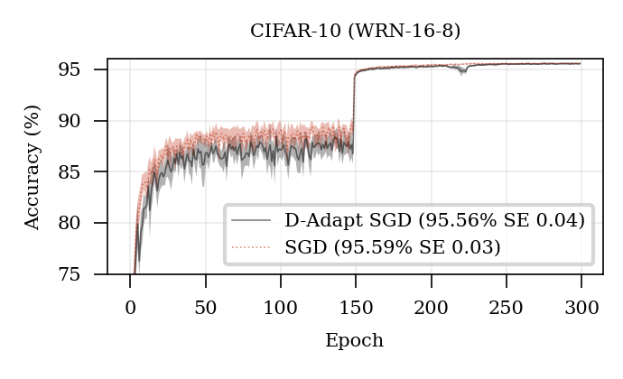
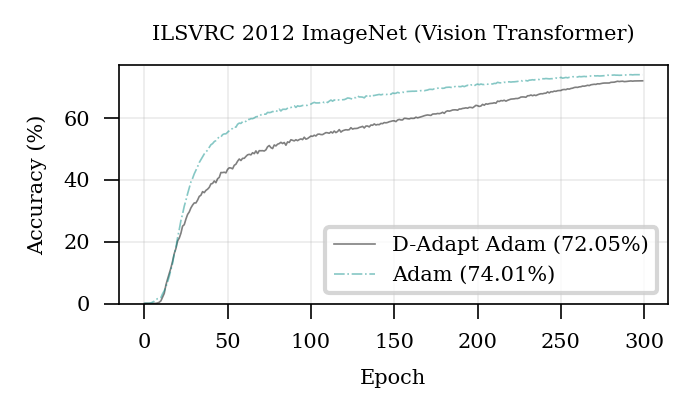
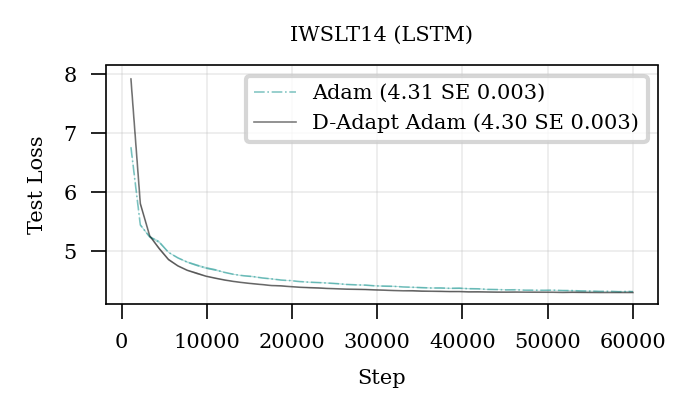
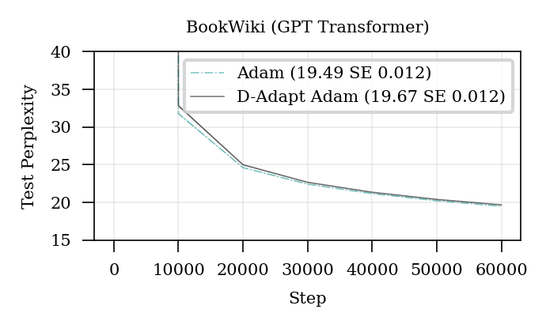
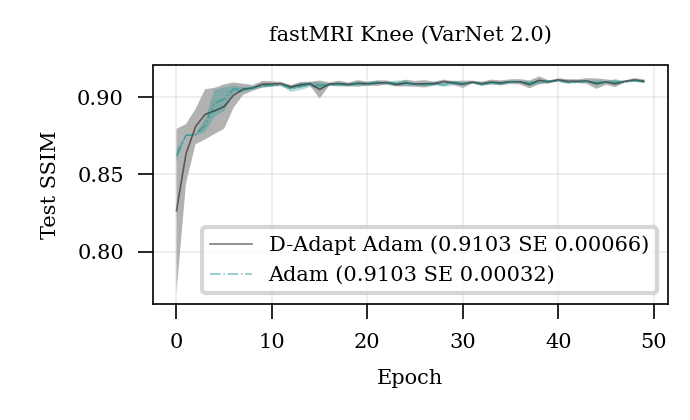
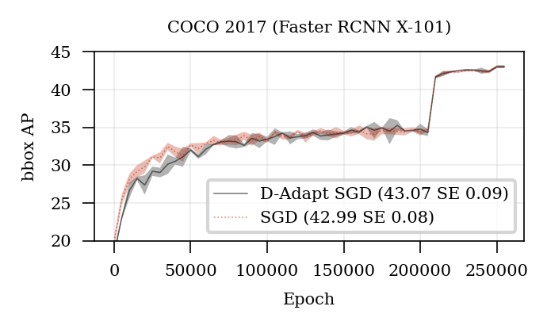

# D-Adaptation

Learning rate free learning for SGD, AdaGrad and Adam! 

``` pip install dadaptation ```

## Details

The provided Pytorch Optimizer classes are drop-in replacements, either copy into your project or use via dadaptation.DadaptSGD,  dadaptation.DAdaptAdam or dadaptation.DAdaptAdaGrad.

 - **Set the LR parameter to 1.0**. This parameter is not ignored, rather, setting it larger to smaller will directly scale up or down the D-adapted learning rate. 
 - **Use the same learning rate scheduler you would normally use on the problem.**
 - The Adam variant supports AdamW style weight decay, just set decouple=True. It is not turned on by default, so if you are replacing your adam implementation, make sure you use decoupled if necessary.
 - It may be necessary to use larger weight decay than you would normally use, try a factor of 2 or 4 bigger if you see overfitting. D-Adaptation uses larger learning rates than people typically hand-choose, in some cases that requires more decay.
 - Use the log_every setting to see the learning rate being used (d*lr) and the current D bound.
 - Only the AdaGrad version supports sparse gradients.
 - The Adam IP variant implements a tighter D bound, which may help on some problems. The IP variants should be considered experimental.
 - If you encounter divergence early on, and are not already using learning rate warmup, try change growth_rate to match a reasonable warmup schedule rate for your problem. 
 
 # Experimental results












# License
See the [License file](/LICENSE).
